# Weekly Insights Report Agent

An automated weekly business report for a (fictional) online retailer, where every KPI is computed by code and the AI-written commentary is **evaluated, guarded, and observable** before it is published, unattended, every Monday.

**Live report: [himanshu2405.github.io/P1-Weekly-Insights-Report-Agent](https://himanshu2405.github.io/P1-Weekly-Insights-Report-Agent/)**

> Status: all phases complete (data pipeline, AI commentary with guards, evaluation, and full automation via GitHub Actions + GitHub Pages).

## The problem

- An LLM can write a weekly business commentary in seconds, but an unchecked LLM can quote wrong numbers, call bad news good, or invent causes.
- One wrong number in a leadership report destroys trust in the whole report.
- This project is not about generating commentary. It is about generating commentary that is **safe to publish without a human rewriting it, and proving it, every single week, with no human in the loop**.

## Architecture

```mermaid
flowchart LR
    CRON["GitHub Actions<br/>Mon 8am ET (2 triggers, DST-safe)"] --> AUTH["GCP auth<br/>Workload Identity Federation"]
    AUTH --> TEST["pytest: guards, judge,<br/>schema, schedule (61 tests)"]
    TEST --> DATA["BigQuery -> KPIs, cuts, targets<br/>(code only, never the LLM)"]
    DATA --> GATE{"6 data-quality<br/>checks pass?"}
    GATE -- "no" --> ISSUE["GitHub issue<br/>opened automatically"]
    GATE -- "yes" --> BRIEF["Data brief JSON<br/>(the only thing Claude sees)"]
    BRIEF --> LLM["Claude writes commentary<br/>local: CLI subscription. CI: API"]
    LLM --> GUARDS{"10 guards:<br/>numbers, direction,<br/>banned claims"}
    GUARDS -- "fail" --> RETRY["Retry once with feedback"] --> LLM
    RETRY -. "fails again" .-> FALLBACK["Template fallback<br/>(numbers still published)"]
    GUARDS -- "pass" --> PAGE
    FALLBACK --> PAGE["Static HTML report<br/>+ trust panel"]
    PAGE --> PAGES["GitHub Pages<br/>public, live"]

    classDef done fill:#e7f5ea,stroke:#1d6b33,color:#0b0b0b
    classDef auto fill:#f3ecfb,stroke:#7a3fc7,color:#0b0b0b
    class CRON,AUTH,TEST auto
    class DATA,GATE,ISSUE,BRIEF,LLM,GUARDS,RETRY,FALLBACK,PAGE,PAGES done
```



Full step-by-step diagram with every file and reliability trap: [docs/ARCHITECTURE.md](docs/ARCHITECTURE.md) ([browser view](docs/architecture.html)).

## How this was built: eval, observability, reliability

This is the core of the project. Generating commentary was the easy part; making it trustworthy enough to publish unattended is where the actual engineering is.

**Reliability (guards, retry, fallback)**
- 10 deterministic checks run on every AI answer before it can publish: numbers must exist in the data brief, direction words ("rose"/"fell") must match the data's actual sign, "ahead/behind target" must match the real attainment, no invented causes or recommendations, anomalies must be acknowledged, the 14-Day Return Rate must name its own week.
- A blocking failure gets **one retry** with the exact failures fed back to Claude. If it still fails, the report publishes with a labeled fallback template and the real numbers, never a guess. This actually happened, live, not in a demo: the first scheduled test run hit a real bug (the Anthropic API's structured-output schema mode rejects constraints the CLI accepts fine) and correctly published the safe fallback instead of a wrong or missing page; the bug was found and fixed the same day.
- Guards themselves were error-analyzed, not trusted blindly: an early pass found most "failures" were guard false positives, not real problems (e.g. "because the value..." flagged as a forbidden cause). Fixing guard precision mattered more for reliability than any single prompt change.

**Evaluation**
- A **golden set** of 16 hand-picked historical weeks (behind/ahead of target, quiet weeks, anomalies, quarter boundaries, traps like "up week-over-week but behind target") plus a **held-out set** of 10 weeks never used to tune anything.
- An **LLM-as-judge**, iterated v1 through v4 against 20 hand-labeled examples (v1 agreed with the human reviewer 85% of the time; after fixing the two vaguest rules, v2 agreed 100% on that same sample, an optimistic number since it's the data the fix was tuned on, not a fresh held-out check), scoring whether each point is a real business implication or just a restated fact.
- Prompt v1 -> v2: the share of "so-what" points that are real implications (not restated facts) went from 68% to 88% on the golden set (same judge version, so directly comparable). v2 was promoted to production on that result.
- Held-out generalization, checked honestly rather than assumed: v2 scored 96% on the golden set under a later judge revision, but only 83% on the 10-week held-out set it was never tuned against, a real but modest gap, not overfit to zero (the two figures use a newer judge than the 68%/88% pair above, so they're comparable to each other, not across that pair).
- A prompt v3 was built and generated on the held-out set (8/10 first-attempt), but deliberately never fully judged or compared against v2: the underlying data is synthetic with no ground truth for "correct" commentary, so finishing that comparison would spend tokens chasing a score, not add a real lesson. That's a judgment call, logged with its reasoning in [P1_Decisions_Log.md](P1_Decisions_Log.md).

**Observability**
- Every run, local or scheduled, writes one line to `runs/run_log.jsonl` (git-tracked): status, which backend and model ran, attempts, tokens, cost, guard pass/fail, and any errors.
- The report page itself carries a trust panel: every data-quality and AI check for that specific run, plus model, prompt version, engine, attempts, tokens, cost, and time, visible to anyone reading the report, not just the engineer.
- Considered and explicitly rejected a hosted tracing platform (LangSmith) for this project: the homegrown log + trust panel already does the job for a once-a-week batch run, and a tracing dashboard's real value is live production traffic, which this isn't. That tradeoff (and where LangSmith *would* make sense) is written up in the decisions log.

**Checks that actually run in production, not just in a demo**
- `.github/workflows/tests.yml`: the full test suite (61 tests, guards, judge, schema, scheduling) runs on every push, no credentials needed.
- `.github/workflows/weekly-report.yml`: guards and tests must pass *inside the scheduled run itself* before anything publishes. GCP authentication uses Workload Identity Federation, so there's no long-lived GCP key to leak or rotate (the one real stored secret is the Claude API key, scoped to CI only). A job failure (bad data, a crash) opens a GitHub issue automatically, no silent failures.
- The first two live test runs surfaced two real bugs in the new CI-only code path (both fixed same-day, see the decisions log); the third run succeeded end to end: **verified, 1 attempt, 10/10 checks passed, $0.1537**, live on GitHub Pages.

## Documents

| Doc | What it answers |
|---|---|
| [docs/ARCHITECTURE.md](docs/ARCHITECTURE.md) | Flow diagram of the whole pipeline, step by step, with file references |
| [PRD.md](PRD.md) | What and why: problem, users, goals, reliability requirements, success metrics |
| [TECH_SPEC.md](TECH_SPEC.md) | How it works: data, KPI definitions, targets, architecture, data brief schema, engine, evals, cost |
| [PLAN.md](PLAN.md) | When: phases, checklist, what each phase needed to learn first |
| [business_context.md](business_context.md) | Stable business facts the LLM reads every week |
| [report_layout.yaml](report_layout.yaml) | Page structure and AI commentary slots (drives rendering, output schema, and guards) |
| [P1_Decisions_Log.md](P1_Decisions_Log.md) | Every design decision, bug found, and why, in the order it happened |

## Data

- BigQuery public dataset `bigquery-public-data.thelook_ecommerce` (fictional e-commerce store). No private or employer data.

## Run it

```bash
python -m venv .venv && .venv/bin/pip install -r requirements.txt && .venv/bin/pip install -e .
gcloud auth application-default login              # BigQuery access
.venv/bin/python -m pytest                          # 61 unit tests, no BigQuery or API key needed
.venv/bin/python scripts/build_report.py --backfill  # briefs + HTML reports: as-of week (site/index.html) + 8-week archive
.venv/bin/python scripts/build_report.py --no-ai     # skip AI commentary entirely (no Claude auth needed)
```

AI commentary needs either `claude auth login` (Claude Code CLI, what local dev uses) or an `ANTHROPIC_API_KEY` environment variable (what CI uses); use `--no-ai` above to build without either.

The live site runs itself: `.github/workflows/weekly-report.yml` triggers every Monday, with no manual step.

## Stack

Python, BigQuery, Claude Code headless (local dev) + Anthropic API (CI), GitHub Actions, GitHub Pages, Google Cloud Workload Identity Federation.
