# Weekly Insights Report Agent

An automated weekly business report for a (fictional) online retailer, where every KPI is computed by code and the AI-written commentary is **evaluated, guarded, and observable** before it is published, unattended, every Monday.

**Live report: [himanshu2405.github.io/P1-Weekly-Insights-Report-Agent](https://himanshu2405.github.io/P1-Weekly-Insights-Report-Agent/)** · **[Interview slide deck](https://claude.ai/artifact/W6K3dQvQGXg9tb5kRU2tnw)**

> Status: all phases complete (data pipeline, AI commentary with guards, evaluation, and full automation via GitHub Actions + GitHub Pages).

## The problem

- An LLM can write a weekly business commentary in seconds, but an unchecked LLM can quote wrong numbers, call bad news good, or invent causes.
- One wrong number in a leadership report destroys trust in the whole report.
- This project is not about generating commentary. It is about generating commentary that is **safe to publish without a human rewriting it, and proving it, every single week, with no human in the loop**.

## Architecture

```mermaid
flowchart LR
    CRON["GitHub Actions<br/>Mon 8am ET (2 triggers, DST-safe)"] --> AUTH["GCP auth<br/>Workload Identity Federation"]
    AUTH --> TEST["pytest: guards, judge,<br/>schema, schedule (61 tests)"]
    TEST --> DATA["BigQuery -> KPIs, cuts, targets<br/>(code only, never the LLM)"]
    DATA --> GATE{"6 data-quality<br/>checks pass?"}
    GATE -- "no" --> ISSUE["GitHub issue<br/>opened automatically"]
    GATE -- "yes" --> BRIEF["Data brief JSON<br/>(the only thing Claude sees)"]
    BRIEF --> LLM["Claude writes commentary<br/>local: CLI subscription. CI: API"]
    LLM --> GUARDS{"10 guards:<br/>numbers, direction,<br/>banned claims"}
    GUARDS -- "fail" --> RETRY["Retry once with feedback"] --> LLM
    RETRY -. "fails again" .-> FALLBACK["Template fallback<br/>(numbers still published)"]
    GUARDS -- "pass" --> PAGE
    FALLBACK --> PAGE["Static HTML report<br/>+ trust panel"]
    PAGE --> PAGES["GitHub Pages<br/>public, live"]

    classDef done fill:#e7f5ea,stroke:#1d6b33,color:#0b0b0b
    classDef auto fill:#f3ecfb,stroke:#7a3fc7,color:#0b0b0b
    class CRON,AUTH,TEST auto
    class DATA,GATE,ISSUE,BRIEF,LLM,GUARDS,RETRY,FALLBACK,PAGE,PAGES done
```



Full step-by-step diagram with every file and reliability trap, plus a simpler phase-level view: [docs/ARCHITECTURE.md](docs/ARCHITECTURE.md) (renders on GitHub), the live [browser view](https://himanshu2405.github.io/P1-Weekly-Insights-Report-Agent/architecture.html), or [open locally](file:///Users/himanshudubey/Documents/AI-learnings/Projects/P1-Weekly-Insights-Report/docs/architecture.html).

## How this was built: eval, observability, reliability

Generating commentary was the easy part. Making it trustworthy enough to publish unattended, every week, is the actual engineering.

**Reliability**
- 10 deterministic guards before anything can publish:
  - Every number must exist in the data brief
  - Direction words ("rose"/"fell") must match the data's actual sign
  - "Ahead/behind target" must match the real attainment
  - No invented causes or recommendations
  - Anomalies must be acknowledged
  - 14-Day Return Rate must name its own week
- On failure: one retry with the exact failures fed back to Claude, then a labeled fallback template with the real numbers, never a guess.
  - Happened for real, not in a demo: the first live scheduled run hit an Anthropic API schema bug, published the safe fallback instead of a broken page, bug fixed the same day.
- Guards were error-analyzed, not trusted blindly: an early pass found most "failures" were false positives. Fixing guard precision mattered more than any single prompt change.

**Evaluation**
- Golden set: 16 hand-picked weeks (anomalies, target misses, quarter boundaries, quiet weeks).
- Held-out set: 10 weeks, never used to tune anything.
- LLM-as-judge, iterated v1 -> v4, calibrated against 20 hand labels:
  - v1: 85% agreement with a human reviewer
  - v2 (fixed the two vaguest rules): 100% on that same sample, an optimistic number since it's the data the fix was tuned on, not a fresh check
- Prompt v1 -> v2 (same judge, golden set): so-what real-implication rate 68% -> 88%. v2 promoted to production on this.
- Held-out generalization, checked honestly: v2 scored 96% golden / 83% held-out under a later judge version, a real but modest gap, not overfit to zero.
- Prompt v3 was built and generated but deliberately never fully judged: the data is synthetic with no ground truth, so finishing that comparison would chase a score, not add a lesson. Reasoning: [P1_Decisions_Log.md](P1_Decisions_Log.md).

**Observability**
- Every run writes one line to `runs/run_log.jsonl` (git-tracked): status, backend, model, attempts, tokens, cost, guard pass/fail, errors.
- The report page carries its own trust panel: every check for that specific run, plus model, prompt version, engine, attempts, tokens, cost, time.
- Considered and rejected a hosted tracing platform (LangSmith): the homegrown log + trust panel already covers a once-a-week batch job; a tracing dashboard earns its keep on live production traffic, which this isn't. Full tradeoff in the decisions log.

**Checks that run in production, not just a demo**
- `.github/workflows/tests.yml`: full test suite (61 tests) on every push, no credentials needed.
- `.github/workflows/weekly-report.yml`: guards and tests must pass *inside the scheduled run itself* before publishing.
  - GCP auth via Workload Identity Federation, no long-lived GCP key (the one real stored secret is the CI-only Claude API key).
  - A job failure opens a GitHub issue automatically.
- The first two live test runs surfaced two real bugs (fixed same day, see the decisions log); the third run succeeded end to end: **verified, 1 attempt, 10/10 checks passed, $0.1537**, live on GitHub Pages.

## Documents

| Doc | What it answers |
|---|---|
| [docs/ARCHITECTURE.md](docs/ARCHITECTURE.md) | Flow diagram of the whole pipeline, step by step, with file references |
| [PRD.md](PRD.md) | What and why: problem, users, goals, reliability requirements, success metrics |
| [TECH_SPEC.md](TECH_SPEC.md) | How it works: data, KPI definitions, targets, architecture, data brief schema, engine, evals, cost |
| [PLAN.md](PLAN.md) | When: phases, checklist, what each phase needed to learn first |
| [business_context.md](business_context.md) | Stable business facts the LLM reads every week |
| [report_layout.yaml](report_layout.yaml) | Page structure and AI commentary slots (drives rendering, output schema, and guards) |
| [P1_Decisions_Log.md](P1_Decisions_Log.md) | Every design decision, bug found, and why, in the order it happened |
| [Interview slide deck](https://claude.ai/artifact/W6K3dQvQGXg9tb5kRU2tnw) | 16-slide portfolio deck: problem, architecture, guards, a real production bug, eval results, generalization, observability, judgment calls |

## Data

- BigQuery public dataset `bigquery-public-data.thelook_ecommerce` (fictional e-commerce store). No private or employer data.

## Run it

```bash
python -m venv .venv && .venv/bin/pip install -r requirements.txt && .venv/bin/pip install -e .
gcloud auth application-default login              # BigQuery access
.venv/bin/python -m pytest                          # 61 unit tests, no BigQuery or API key needed
.venv/bin/python scripts/build_report.py --backfill  # briefs + HTML reports: as-of week (site/index.html) + 8-week archive
.venv/bin/python scripts/build_report.py --no-ai     # skip AI commentary entirely (no Claude auth needed)
```

AI commentary needs either `claude auth login` (Claude Code CLI, what local dev uses) or an `ANTHROPIC_API_KEY` environment variable (what CI uses); use `--no-ai` above to build without either.

The live site runs itself: `.github/workflows/weekly-report.yml` triggers every Monday, with no manual step.

## Stack

Python, BigQuery, Claude Code headless (local dev) + Anthropic API (CI), GitHub Actions, GitHub Pages, Google Cloud Workload Identity Federation.
