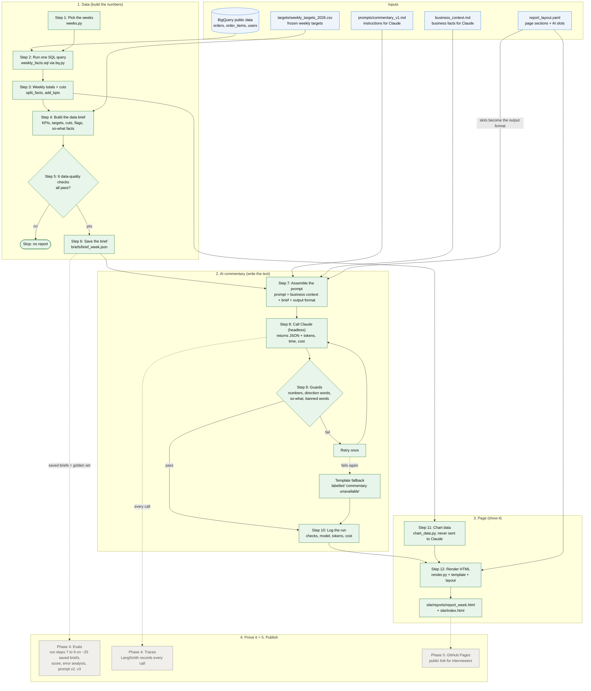

# How the weekly report is built

One command runs everything for one week: `python scripts/build_report.py --week 2026-08-03`.

Colors: green = built, grey = Phase 4 and 5 (later). Phase 2 completed 2026-09-25.

Browser view: open `docs/architecture.html` (regenerate it after editing `docs/architecture.mmd` with `python scripts/build_architecture_html.py`).

## Step by step

| Step | What happens | Code / file | Why it exists | Status |
|---|---|---|---|---|
| 1 | Work out the reporting week, prior week, same week last year, mature week (for returns), quarter and fiscal-year weeks | `weeks.py` | Every number depends on picking the right weeks | Built |
| 2 | Run one SQL query: orders, cancellations, 14-day returns, revenue, signups per week x country x traffic source | `sql/weekly_facts.sql`, `bq.py` | One scan (~31 MB), capped at 500 MB so a mistake can never cost money | Built |
| 3 | Sum the rows into weekly totals; keep 3 weeks for region and traffic cuts; derive AOV and rates | `brief.py` (`split_facts`, `add_kpis`) | Rates and AOV are computed once, rounded exactly as shown | Built |
| 4 | Build the data brief: 6 KPIs with WoW, YoY, ITPY and good/bad; weekly, QTD, YTD and monthly vs target; cuts; flags; so-what facts | `brief.py`, `rules.py`, `targets.py` | The brief is the only thing Claude sees, so every number and judgement is decided here by code | Built |
| 5 | Run 6 data-quality checks (week complete, no missing weeks, targets present, countries mapped, row count sane, mature week ready) | `brief.py` (`quality_checks`) | Bad data stops the run before any AI or page is produced | Built |
| 6 | Validate the brief against its schema and save it | `models.py`, `briefs/` | A malformed brief can never reach Claude; saved briefs become the golden set for evals | Built |
| 7 | Assemble the prompt: instructions + business context + brief + output format (from the layout's AI slots) | `prompts/commentary_v1.md`, `commentary_schema.py`, `report_layout.yaml` | Versioned prompt, so we can show which version scored better; the output format always matches the page's boxes | Built |
| 8 | Call Claude headless once; get JSON commentary plus tokens, time and cost | `llm.py` (`generate()`), `scripts/generate_commentary.py` | Clean, measurable call; can be swapped for the API later | Built |
| 9 | Guards check the text: every number in the brief, direction words match, every point has a so-what, no causes, recommendations or "plan". Fail: retry once, then a labelled template | `guards.py`, `commentary.py` | A wrong number is never published | Built |
| 10 | Log the run: checks passed, model, prompt version, tokens, cost, time | `commentary.log_run` -> `runs/run_log.jsonl` | Observability and cost tracking; feeds the trust panel | Built |
| 11 | Build chart series from the weekly data and targets | `chart_data.py` | Charts need 52 weeks and future targets; Claude never sees this | Built |
| 12 | Render the HTML page from the layout, brief, charts and commentary | `render.py`, `templates/` | The report leadership reads | Built |
| Evals | Run steps 7 to 9 on ~25 saved briefs at once; score, read failures, improve the prompt | Phase 4 | Proves reliability with evidence | Later |
| Traces | Record every Claude call in LangSmith | Phase 4 | See exactly what Claude saw and said | Later |
| Publish | Put `site/` on GitHub Pages | Phase 5 | A link to share | Later |
