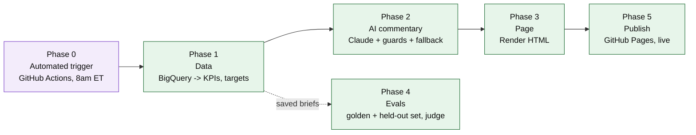
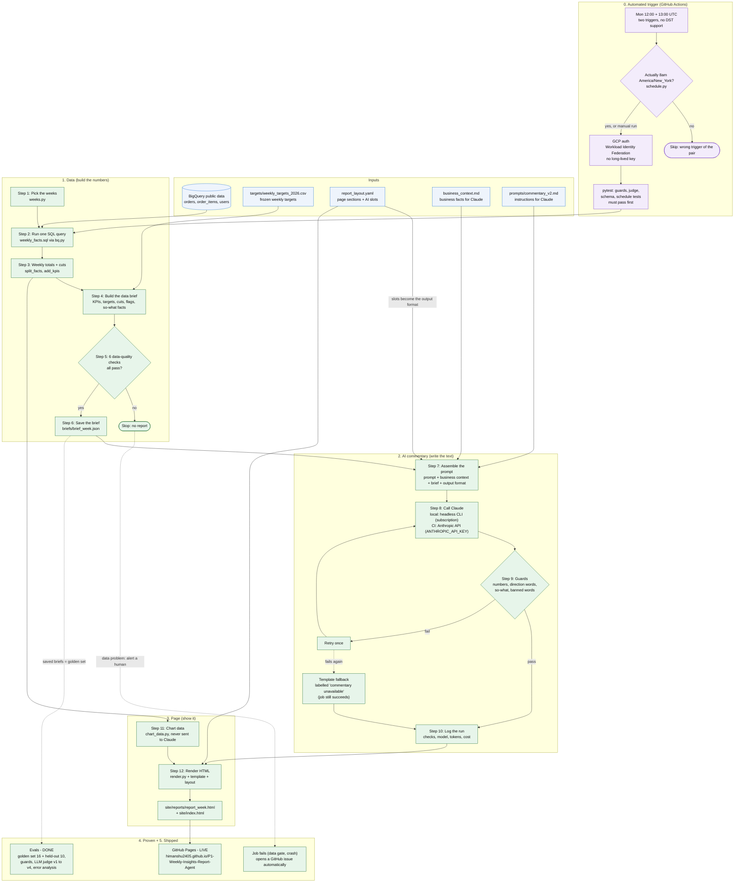

# How the weekly report is built

Runs itself every Monday via GitHub Actions, or by hand: `python scripts/build_report.py --week 2026-08-03`.

Colors: purple = automation (Phase 5), green = built and shipped, blue = inputs. All phases complete.

Browser view (live, standalone page): https://himanshu2405.github.io/P1-Weekly-Insights-Report-Agent/architecture.html (published alongside the report; regenerate it with `python scripts/build_architecture_html.py` after editing `docs/architecture_simple.mmd` or `docs/architecture.mmd` - the two diagrams below are copies, kept in sync by hand).

Live report: https://himanshu2405.github.io/P1-Weekly-Insights-Report-Agent/

## Simple view: the 5 phases

Source: `docs/architecture_simple.mmd`.

## Detailed view: every step and file

Source: `docs/architecture.mmd`.

## Step by step

| Step | What happens | Code / file | Why it exists | Status |
|---|---|---|---|---|
| 0a | Two cron triggers fire (12:00 and 13:00 UTC Monday); a guard proceeds only if it's actually 8am America/New_York, so the DST-shifted trigger is a no-op | `.github/workflows/weekly-report.yml`, `schedule.py`, `scripts/should_run_now.py` | GitHub Actions cron is UTC-only with no daylight-saving support | Built |
| 0b | Authenticate to GCP by exchanging GitHub's OIDC token for short-lived credentials, no key file anywhere | `scripts/setup_gcp_wif.sh` (one-time), `google-github-actions/auth` in the workflow | No long-lived secret to leak or rotate | Built |
| 0c | Run the full test suite (guards, judge, schema, schedule) before anything else runs | `.github/workflows/tests.yml` (every push) and as a pre-publish gate inside `weekly-report.yml` | Eval-in-CI: a regression is caught before it can reach a real run | Built |
| 1 | Work out the reporting week, prior week, same week last year, mature week (for returns), quarter and fiscal-year weeks | `weeks.py` | Every number depends on picking the right weeks | Built |
| 2 | Run one SQL query: orders, cancellations, 14-day returns, revenue, signups per week x country x traffic source | `sql/weekly_facts.sql`, `bq.py` | One scan (~31 MB), capped at 500 MB so a mistake can never cost money | Built |
| 3 | Sum the rows into weekly totals; keep 3 weeks for region and traffic cuts; derive AOV and rates | `brief.py` (`split_facts`, `add_kpis`) | Rates and AOV are computed once, rounded exactly as shown | Built |
| 4 | Build the data brief: 6 KPIs with WoW, YoY, ITPY and good/bad; weekly, QTD, YTD and monthly vs target; cuts; flags; so-what facts | `brief.py`, `rules.py`, `targets.py` | The brief is the only thing Claude sees, so every number and judgement is decided here by code | Built |
| 5 | Run 6 data-quality checks (week complete, no missing weeks, targets present, countries mapped, row count sane, mature week ready) | `brief.py` (`quality_checks`) | Bad data stops the run before any AI or page is produced, and fails the job so an alert fires | Built |
| 6 | Validate the brief against its schema and save it | `models.py`, `briefs/` | A malformed brief can never reach Claude; saved briefs become the golden set for evals | Built |
| 7 | Assemble the prompt: instructions + business context + brief + output format (from the layout's AI slots) | `prompts/commentary_v2.md`, `commentary_schema.py`, `report_layout.yaml` | Versioned prompt, so we can show which version scored better; the output format always matches the page's boxes | Built |
| 8 | Call Claude once; local dev uses the subscription CLI, the scheduled workflow uses the Anthropic API (no access to a local login); get JSON commentary plus tokens, time and cost either way | `llm.py` (`call_structured()`, `_claude_headless`, `_anthropic_api`) | Same function, same downstream shape either way; CI needed a real API key since it has no interactive session | Built |
| 9 | Guards check the text: every number in the brief, direction words match, every point has a so-what, no causes, recommendations or "plan". Fail: retry once, then a labelled template (the job still succeeds; a bad AI answer never blocks publishing the real numbers) | `guards.py`, `commentary.py` | A wrong number is never published | Built |
| 10 | Log the run: checks passed, model, prompt version, tokens, cost, time; committed back to git by the workflow | `commentary.log_run` -> `runs/run_log.jsonl` | Observability and cost tracking; feeds the trust panel | Built |
| 11 | Build chart series from the weekly data and targets | `chart_data.py` | Charts need 52 weeks and future targets; Claude never sees this | Built |
| 12 | Render the HTML page from the layout, brief, charts and commentary | `render.py`, `templates/` | The report leadership reads | Built |
| Evals | Golden set (16 weeks) + held-out set (10 weeks); 10 deterministic guards; LLM-as-judge (judge_v1 to v4, calibrated against hand labels); guard error analysis | `evals/`, `guards.py`, `judge.py` | Proves reliability with evidence, not a claim | Built |
| Publish | `site/` deployed to GitHub Pages by the workflow itself, on every successful scheduled or manual run | `.github/workflows/weekly-report.yml` | A public link, live | Built |
| Alert | Any job failure (a data-quality stop, a crash, a broken test) opens a GitHub issue automatically | `.github/workflows/weekly-report.yml` (`alert-on-failure` job) | Failures are visible, not silent | Built |

## What is deliberately not here

- **LangSmith / hosted tracing**: evaluated and deferred to P2. This project's homegrown stack (guards, judge, `run_log.jsonl`, error analysis) already does the eval/observability job for a manual weekly batch; a live chatbot with continuous traffic is where a tracing dashboard actually earns its keep. See `P1_Decisions_Log.md`, 2026-09-27.
- **RAG**: the whole context (business facts, an 8-week data brief, targets) fits in one prompt; retrieval would add cost and failure modes for no gain.
- **A live API server / container / Cloud Run**: this is a scheduled batch job plus a static page, not a service that needs to keep running. Those pieces (FastAPI, Docker, Cloud Run) are scoped to P2's chatbot instead.
